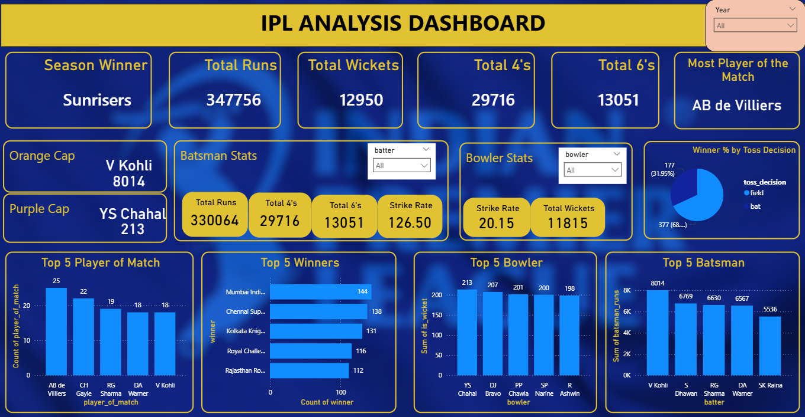

# 🏏 IPL Analysis Dashboard (Power BI)

## 📊 Overview

This project presents an interactive Power BI dashboard analyzing Indian Premier League (IPL) data across multiple seasons. It provides insights into team performance, player statistics, and match outcomes using real-world cricket data.

---

## 🎯 Objectives

* Analyze team performance across seasons
* Identify top players (batsmen & bowlers)
* Study toss impact on match results
* Visualize trends in runs, wickets, and match outcomes

---

## 🔥 Key Features

* 🏆 **Season Winner** (dynamic based on selected year)
* 📈 Total Runs, Wickets, 4's, and 6's
* 🧢 **Orange Cap** (highest run scorer)
* 🎯 **Purple Cap** (highest wicket taker)
* 🥇 Most Player of the Match awards
* 📊 Top 5 Teams by Wins
* 🏏 Top 5 Batsmen and Bowlers
* 🎯 Toss decision impact on winning percentage

---

## 🛠️ Tools & Technologies

* Power BI (Dashboard & Visualization)
* Data Modeling (Relationships between tables)
* DAX (for calculated measures)
* CSV Dataset

---

## 📂 Dataset

- matches.csv → 1096 rows (match-level data)
- deliveries.csv → 260,921 rows (ball-by-ball data)

> ⚠️ Note: The full deliveries dataset exceeds GitHub's file size limit.
> 📥 Download full dataset here: **https://drive.google.com/drive/folders/1oEjV1xpDvxu5JTwNSi6W6tiz6c7wU7Xy?usp=drive_link**

---

## 📸 Dashboard Preview



---

## 🧠 Key Insights

* 🏆 Mumbai Indians is the most successful IPL team based on total wins
* 🔄 Teams choosing to field first tend to win more matches
* 💥 AB de Villiers has a high impact with multiple Player of the Match awards
* 🔥 Virat Kohli leads in total runs among top batsmen

---

## 🚀 How to Use

1. Download the `.pbix` file
2. Open it in **Power BI Desktop**
3. Load datasets if prompted
4. Use filters (Year, Batsman, Bowler) to explore insights

---

## 📌 Project Structure

```
IPL-PowerBI-Dashboard/
│
├── data/
│   ├── matches.csv
│   └── deliveries_sample.csv
│
├── dashboard.pbix
├── dashboard.png
└── README.md
```

---

## 👨‍💻 Author

**Arnav Mathur**
B.Tech CSE (AI/ML) Student

---
